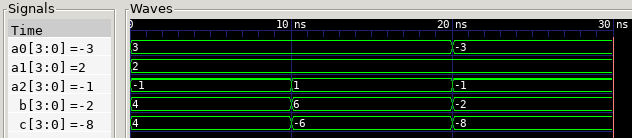

# Best practices using VHDL subprograms: Use functions! #
In synthesizable RTL-code, functions should always be preferred above procedures.

## Rationale 
Functions will always compile into combinational logic. Procedures may be used to create feedback loops and latches, whether by intention or not. 

Knowing that a subprogram does not infer latches makes verification easier. 
Using functions, the designer will get feedback at the earliest possible stage, compilation, when logic that should be combinational ends up being non-combinational. 

In contrast, when using a procedure, this cannot be taken for granted. This means higher effort must be used in verifying that the code does what it should. 
Feedback on erronous behavior may be found during functional testing of the RTL code (testbench), it may be found during synthesis if feedback loops are present, however neither can be guaranteed. Formal verification may prove this, however using a function already formally proves that the content is combinational.  

Procedures may infer registers, which can be one way to build structures equivalent to the use of components. 
However, this is something you would do when writing structural code, rather than RTL-code. 
Using structural coding within RTL-modules make verification more complex, which means mixing structure and RTL is not best practice.

### Example and discussion

Consider these subprograms:
```vhdl
function sum_function(vect: integer_vector)return integer is
    variable sum: integer:=0;
  begin
    for i in vect'range loop
      sum := sum+vect(i);
    end loop;
    return sum;
  end; 
```
<sup>Using a function is the best solution</sup>

```vhdl
-- example of bad practice leading to errors:
procedure sum_proc(vect: in integer_vector; sum: out integer) is
  begin 
    for i in vect'range loop
      sum := sum + vect(i);
    end loop; 
  end;
```
<sup>procedure may cause erratic behavior, if it compiles [^1]</sup>

These are being implemented using the following entity and process: 
```vhdl
entity subprogram is
  generic(k: positive:=4);
  port(
    a2,a1,a0 : in  std_ulogic_vector(k-1 downto 0);
    b,c      : out std_ulogic_vector(k-1 downto 0) );
end entity subprogram;
```

```vhdl
process(all) is
  variable v: integer_vector(2 downto 0);
  variable sumf, sump: integer;
  variable sf, sp: signed(c'range);
begin
  v:=(
    to_integer(signed(a2)),
    to_integer(signed(a1)),
    to_integer(signed(a0)) );

  -- subprogram use
  sumf := sum_function(v);
  sumproc(v, sump);

  -- size and type conversion  
  sf := to_signed(sumf, sf'length);
  sp := to_signed(sump, sp'length);
  b <= std_logic_vector(sf);
  c <= std_logic_vector(sp);

end process;
```

If we simulate this by feeding different input we may get something like this[^1]:


<sup>Waveform output from simple testing of function and procedure. 
Here ```b``` contains the result from the function and ```c``` contains the result of the procedure. 
Here both subprograms is supposed to calculate ```a0+a1+a2```
</sup>
[^1]: The procedure example does not compile with GHDL 5, this example was created at a time questa was used in our digital design course. There are ways of obtaining the same result in a procedure using GHDL 5, such as performing the addition using signed logic without a loop. That is, one example of poor code being caught in compilation does not mean every example of poor code will, it does not change what is best practice.   

The cause for ```b``` and ```c``` being different is that the procedure causes a feedback loop.
During simulation the output is only calculated when the input changes, which means the procedural output may accumulate during simulation.  
By using the sum output in the procedural calculation, what should be combinational becomes a loop that feeds itself. 

A good synthesis tool will warn against this behavior since the output is not deterministic. 
It can be avoided in either the mother process by setting ```sump := 0``` before using it in the procedure, or inside the procedure by utilizing a sum variable in the procedure that to hold all steps of the calculation before assigning the output. 
However, the issue here is not fixing the problem once identified, it is that it is easy to overlook this type of error. 

The complexity in this example is relatively low, yet it hides errors that can be avoided entirely, simply by using a function. 
The fact that there are several places the issues with the procedure may be fixed, only adds to the problem: 
_One engineer may use a certain procedure without issues, while another may use it in a way that leads to disastrous results._ 

In sum, using functions is best practice, until there is a particular reason for using a procedure, see discussion below. 

## Counterexamples and limitations
### Multiple output vectors
VHDL procedures are created to only allow changes in a single output vector. 
When creating digital logic it is often desirable to have more than one output. 
An example of this would be a division or square root algorithm where the calculations reveal a reminder or error along with the result, which may be useful. 

#### Possible workaround
In VHDL, this can be worked around using a record type output, combining all useful output of the function. 
Now this step may come at the cost of convenience, since using all vectors requires packing and unpacking the record in use. 

This inconvenience is a drawback, that technically could or should be adressed in future revisions of VHDL.  

For the sake of verification, a procedure can be used to wrap a function using a record as output, when we do want the separate output without making the record definition public. 
Adding extra layers sacrifices some readability, but it can be done such that it is easy to understand that only combinational logic is used, without digging into the details of what the function actually does.  


### Getting the most out of synthesis
Sometimes using a procedure will create better results in tools for certain manufacturers. 
While tool dependent, this can be shown when switching between logically equivalent solutions. 
Fixing this goes into the category of tweaking code to please the synthesizer, which means we abandon readability and make verification harder. 

However there is a way to secure a verifiable route: 
* The first step then is to design and verify code using functions. 
* Next step is creating the same functionality using a procedure. 
* Last step is to formally verify (prove) logical equivalence between the function and the procedure. 

By keeping the code and verification results for each step, we have a chain of easily verifiable steps, which should be reassuring to anyone using the code. 
