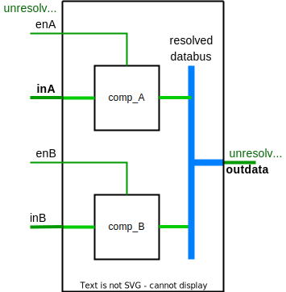

# Use unresolved types!
Use unresolved types when creating signals or ports, unless the resolution function is required. 

## Rationale
Using the resolution function for ```std_logic```, ```signed``` and ```unsigned``` hides errors when a signal is assigned driver multiple times in an architecture. 
By using unresolved types ```std_ulogic```, ```std_ulogic_vector```, ```u_signed``` and ```u_unsigned```, signals that are driven from multiple sources are discovered during compilation.

Finding errors at compilation saves time, compared to sifting through errors that occur at random or odd times due to poor coding or accidental use. 

In early student projects it is common that students misconceive what signal assignment does[^1]. 
For engineers having overcome typical misconceptions, it may still be easy to overlook errors due to signals being assigned in multiple instances when working with complex code. 
This goes especially when working late or reviewing code. 
By using unresolved types these errors are reported immediately, leading to faster learning and faster verification processes.  

[^1]: For students being used to software programming, the concept of parallelism when describing hardware circuits can be hard to grasp. 
This often results in attempts to assign signals using multiple statements in an architecture, in an attempt to achieve sequential behavior.  
Similarly students that have trouble understanding register usage or default statements in processes often attempt resetting signals that are not used for registers.
This means signals may work well during most or all functional verification, but fails during synthesis. 


## About resolution
A resolved signal uses the resolution function to calculate the result when a signal is assigned by multiple sources. 
Example: For a **std_logic** signal this means that a signal that is assigned to both 
**'1'** and **'0'** in will be **'X'** during simulation. 

This can be useful when simulating bus interfaces with multiple connections featuring high-impedance operation. 
In all other cases we want each signal to have a single source to generate their value. 

It is thus best practice to have the compiler catch dual or multiple assignments, 
rather than hoping that it will be found during simulation. 

```vhdl
library IEEE
use IEEE.std_logic_1164.all;
use IEEE.numeric_std.all;

entity resolved is
  port(
    clk, reset : in  std_ulogic;
    in_vector  : in  std_ulogic_vector(7 downto 0);
    out_vector : out std_ulogic_vector(7 downto 0) 
  );
end resolved;

architecture RTL of resolved is  
  --unresolved type usage 
  signal flag        : std_ulogic;
  signal counter     : u_unsigned(7 downto 0);
  signal temperature : u_signed(7 downto 0);  

begin
  ...
```

<sup>Example of unresolved type definition</sup>


## Switching to unresolved types 
Using the std_logic_1164 and numeric_std libraries, we can simply add and ***u*** or ***u_*** in port- and signal declarations to achieve unresolved types, as shown in the example above.
As long as there is no buses connected to multiple sources involved, it should be safe to change every resolved signal to their unresolved counterparts. 
A resolved signal can be used as a source to assign values to an unresolved signal and vice versa. 

### Compilation errors
When changing a port or signal to an unresolved type causes compilation errors, this means we have either
1. Assigned the same signal in two different statements or processes
2. Mapped more than one signal to an input 
Either way, one of the assignments has to go, unless we deliberately want to a bus capable of using tristate. 

**Note about non-register signals:** 
It is a common error to think all signals should be reset, or not understanding what signals are register outputs. 
*Signals that are used combinationally does not need to, and should not be reset under any circumstance.* 
They will get predictable values as long as their upstream source is predictable. 

### Type casting unresolved signals?
Type casting is not affected by the use of unresolved types. 
Casting does not change a signal, it only changes how the compiler interprets the values, thus the following will work, regardless of the use of (un)resolved types:
```vhdl
  temperature <= signed(in_vector);
  out_vector  <= std_logic_vector(counter);
```

## Counter example and limitations
The main reason to use resolved types is when connecting multiple modules to a bus. 
This, however, can usually be performed with a limited use of resolved types. 

Consider this example:


<sup>Bus connecting modules</sup>

Bus component for testing 
```vhdl
library IEEE;
  use IEEE.std_logic_1164.all; 
  
entity buscomp is 
port(
  enable  : in std_ulogic;
  indata  : in std_ulogic_vector(3 downto 0);
  outdata : out std_ulogic_vector(3 downto 0));  
end entity;

architecture tristate of buscomp is
begin 
  outdata <= 
    indata when enable else 
    (others => 'Z');
end architecture;
```
<sup>Bus component </sup>

Top module, connecting a number of components.
```vhdl
library IEEE;
  use IEEE.std_logic_1164.all; 

entity bustop is 
  port(
    inA, inB   : in std_ulogic_vector(3 downto 0);
    enA, enB : in std_ulogic;
    outdata  : out std_ulogic_vector(3 downto 0) 
  );
end entity;

architecture structural of bustop is
  component buscomp is 
    port(
      enable  : in std_ulogic;
      indata  : in std_ulogic_vector(3 downto 0);
      outdata : out std_ulogic_vector(3 downto 0)
    );  
  end component;
  
  -- Resolved signal needed: 
  signal databus : std_logic_vector(3 downto 0);
  
  -- Will cause comp error: 
  -- signal databus : std_ulogic_vector(3 downto 0);

begin 
  COMP_A: buscomp
  port map (
    enable  => enA,
    indata  => inA,
    outdata => databus    
  );
  
  COMP_B: buscomp
  port map (
    enable  => enB,
    indata  => inB,
    outdata => databus    
  );
  
  outdata <= databus;

end architecture structural;
```
<sup>Module with a bus. The bus is the only resolved signal in use</sup>
